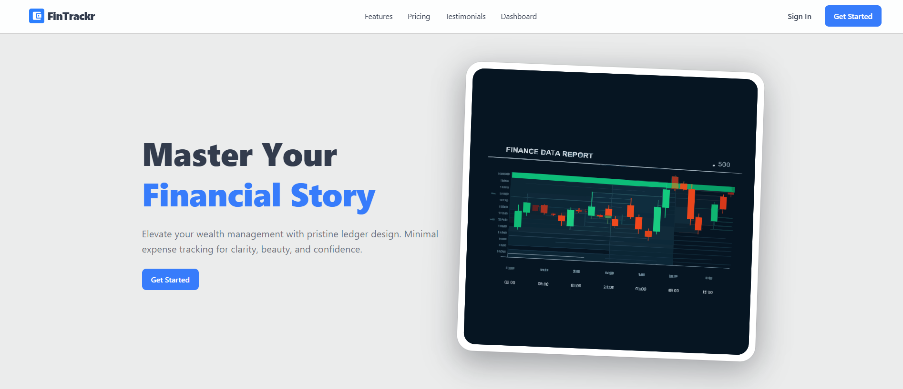
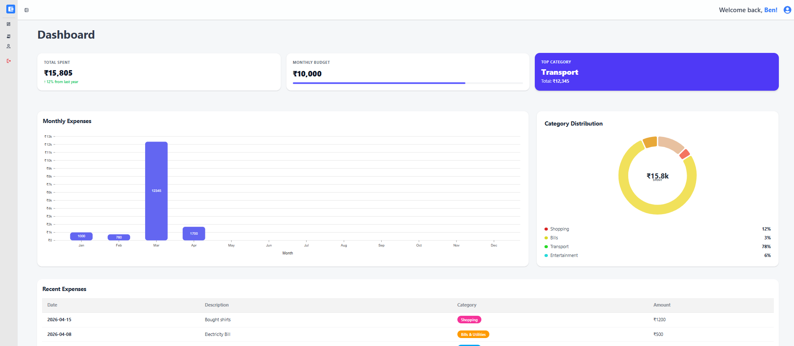
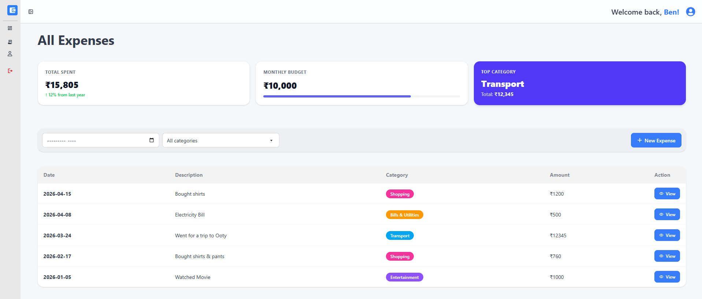
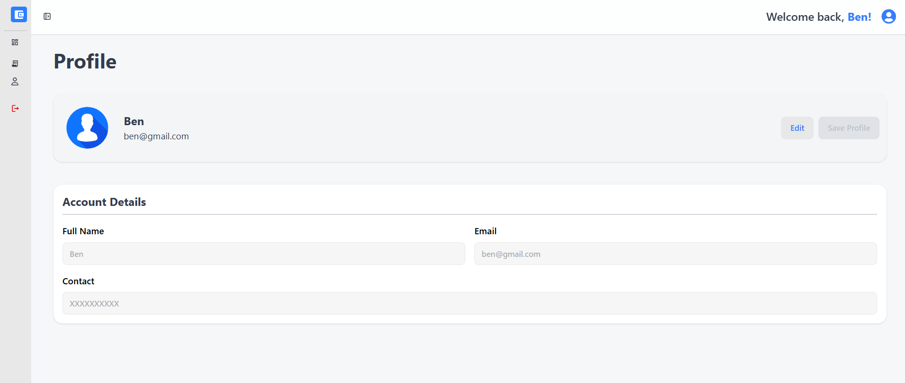

# 💰 FinTrackr — Frontend

> A modern, responsive expense tracking dashboard built with React & Tailwind CSS — visualize, manage, and take control of your finances.

---

## 📖 Description

**FinTrackr Frontend** is a single-page application that provides an intuitive interface for personal expense management. Users can sign up, log in, view detailed spending analytics through interactive charts, manage individual expenses with full CRUD support, and customize their profile — all within a clean, responsive UI.

### How It Connects to the Backend

The frontend communicates with the [FinTrackr API](../expense-tracker-api) (FastAPI) via a centralized Axios client. All authenticated requests include a JWT Bearer token managed through React Context. Server state (expenses, stats, profile) is cached and synchronized using **TanStack React Query**.

---

## 🔗 Live Demo

> 🚀 **Deployed on Vercel:** [https://fintrackr.vercel.app](https://fintrackr.vercel.app)
>
> _Update the link above once deployed._

---

## 🛠️ Tech Stack

| Layer               | Technology                                      |
| ------------------- | ----------------------------------------------- |
| **Framework**       | React 19 (Vite 8)                               |
| **Styling**         | Tailwind CSS 4 + DaisyUI 5 (Emerald theme)      |
| **State Management**| React Context API (Auth) + TanStack React Query  |
| **Routing**         | React Router DOM v7                              |
| **HTTP Client**     | Axios (centralized API client with interceptors) |
| **Forms**           | React Hook Form                                  |
| **Charts**          | Nivo (Bar Chart + Pie Chart)                     |
| **Notifications**   | React Hot Toast                                  |
| **Icons**           | React Icons                                      |
| **Linting**         | ESLint 9                                         |
| **Build Tool**      | Vite 8                                           |

---

## ✨ Features

- 🔐 **Authentication** — Signup & login with JWT-based session management
- 📊 **Interactive Dashboard** — Summary cards, bar chart, and category pie chart
- 💸 **Expense Management** — Full CRUD: create, view, edit, and delete expenses
- 📅 **Date Filtering** — Filter expenses by month/year with instant updates
- 🏷️ **Category Support** — Color-coded categories (Food, Transport, Shopping, Bills, Entertainment)
- 👤 **Profile Management** — View and update name & email
- 🔒 **Protected Routes** — Automatic redirects for unauthenticated users
- 🚪 **Public Route Guards** — Logged-in users are redirected away from login/signup
- 📱 **Responsive Layout** — Sidebar drawer with mobile hamburger menu (DaisyUI)
- 🌗 **Dark Mode Ready** — CSS custom properties with `prefers-color-scheme` support
- 🔔 **Toast Notifications** — Success/error feedback on all actions
- ⚡ **Smart Caching** — 5-minute stale time with automatic cache invalidation
- 🛡️ **Auto Logout** — Token expiration triggers automatic logout via Axios interceptor

---

## 🖼️ Screenshots / UI Preview

> _Add screenshots to a `screenshots/` directory and uncomment the lines below._






---

## 📁 Project Structure

```
expense-tracker-frontend/
│
├── public/
│   └── favicon.svg
│
├── src/
│   ├── api/
│   │   ├── client.js              # Axios instance, interceptors, token provider
│   │   ├── expenseApi.js           # Expense CRUD API functions
│   │   └── userApi.js              # User profile API functions
│   │
│   ├── assets/
│   │   ├── hero-image.svg          # Landing page illustration
│   │   └── user-profile.svg        # Profile page illustration
│   │
│   ├── components/
│   │   ├── AuthForm.jsx            # Reusable login/signup form
│   │   ├── BarChart.jsx            # Nivo bar chart for spending trends
│   │   ├── CategoryPieChart.jsx    # Nivo pie chart by category
│   │   ├── ExpenseModal.jsx        # View/edit/delete expense modal
│   │   ├── ProtectedNavbar.jsx     # Navbar for authenticated pages
│   │   ├── ProtectedRoute.jsx      # Route guard (requires auth)
│   │   ├── PublicNavbar.jsx        # Navbar for public pages
│   │   ├── PublicRoute.jsx         # Route guard (redirects if authed)
│   │   ├── RecentExpenses.jsx      # Recent expenses list widget
│   │   ├── Sidebar.jsx             # App sidebar navigation
│   │   └── SummarySection.jsx      # Stats summary cards
│   │
│   ├── config/
│   │   └── expenseCategories.js    # Category definitions with colors
│   │
│   ├── context/
│   │   └── AuthContext.jsx         # Auth state provider (login/signup/logout)
│   │
│   ├── hooks/
│   │   ├── useExpenses.js          # Expense queries & mutations
│   │   ├── useExpensesStats.js     # Expense statistics query
│   │   └── useProfile.js           # Profile query & mutation
│   │
│   ├── layoutes/
│   │   ├── AppLayout.jsx           # Authenticated layout (sidebar + navbar)
│   │   └── PublicLayout.jsx        # Public layout (navbar only)
│   │
│   ├── lib/
│   │   └── queryClient.js          # TanStack Query client configuration
│   │
│   ├── pages/
│   │   ├── Home.jsx                # Landing page
│   │   ├── Login.jsx               # Login page
│   │   ├── Signup.jsx              # Signup page
│   │   ├── Dashboard.jsx           # Dashboard with charts & stats
│   │   ├── Expenses.jsx            # Expense list with filters
│   │   ├── CreateExpense.jsx       # New expense form
│   │   ├── Profile.jsx             # User profile page
│   │   └── NotFoudPage.jsx         # 404 page
│   │
│   ├── services/
│   │   └── auth.service.js         # Auth API calls (login/signup)
│   │
│   ├── App.jsx                     # Root component with routes
│   ├── App.css                     # App-level styles
│   ├── main.jsx                    # Entry point (providers setup)
│   └── index.css                   # Global styles & CSS variables
│
├── .env.local                      # Environment variables
├── .gitignore
├── index.html                      # HTML entry point
├── package.json
├── vite.config.js                  # Vite + Tailwind + React plugin
└── eslint.config.js
```

---

## 🚀 Installation & Setup

### Prerequisites

- **Node.js 18+** and **npm** installed
- **FinTrackr API** backend running ([setup guide](../expense-tracker-api/README.md))

### Steps

```bash
# 1. Clone the repository
git clone https://github.com/<your-username>/expense-tracker-frontend.git

# 2. Navigate to the project directory
cd expense-tracker-frontend

# 3. Install dependencies
npm install

# 4. Create environment file
cp .env.example .env.local
# Then edit .env.local with your API URL (see section below)
```

---

## ▶️ Running the Project

```bash
# Start development server
npm run dev
```

The app will be available at **http://localhost:5173**

### Other Commands

| Command             | Description                        |
| ------------------- | ---------------------------------- |
| `npm run dev`       | Start dev server with HMR          |
| `npm run build`     | Build for production               |
| `npm run preview`   | Preview production build locally   |
| `npm run lint`      | Run ESLint                         |

---

## 🔑 Environment Variables

Create a `.env.local` file in the project root:

```env
VITE_API_URL=http://localhost:8000
```

| Variable       | Description                                | Example                                              |
| -------------- | ------------------------------------------ | ---------------------------------------------------- |
| `VITE_API_URL` | Base URL of the FinTrackr backend API       | `http://localhost:8000` or `https://api.example.com` |

> ⚠️ **Important:** All Vite env variables must be prefixed with `VITE_` to be exposed to the client.

---

## 📡 API Integration

The frontend uses a **centralized Axios client** (`src/api/client.js`) with:

- **Request interceptor** — Automatically attaches `Authorization: Bearer <token>` header
- **Response interceptor** — Normalizes responses, handles 401 by triggering logout
- **Token provider pattern** — AuthContext dynamically provides the latest token

### Endpoints Consumed

| Method   | Endpoint                          | Used In            |
| -------- | --------------------------------- | ------------------- |
| `POST`   | `/auth/signup`                    | Signup page          |
| `POST`   | `/auth/login`                     | Login page           |
| `GET`    | `/expenses`                       | Dashboard, Expenses  |
| `GET`    | `/expenses/filter_by_month_year`  | Expenses (filtered)  |
| `GET`    | `/expenses/stats/`                | Dashboard, Expenses  |
| `POST`   | `/expenses/`                      | Create Expense       |
| `PUT`    | `/expenses/{id}`                  | Expense Modal        |
| `DELETE` | `/expenses/{id}`                  | Expense Modal        |
| `GET`    | `/user/profile`                   | Profile page         |
| `PATCH`  | `/user/profile`                   | Profile page         |

---

## 🗺️ Routing / Pages

| Route               | Page            | Access      | Description                              |
| -------------------- | --------------- | ----------- | ---------------------------------------- |
| `/`                  | Home            | 🌐 Public   | Landing page with hero section & CTA     |
| `/login`             | Login           | 🌐 Public   | User login form                          |
| `/signup`            | Signup          | 🌐 Public   | User registration form                   |
| `/dashboard`         | Dashboard       | 🔒 Protected| Analytics dashboard with charts & stats  |
| `/expenses`          | Expenses        | 🔒 Protected| Full expense list with filters & actions |
| `/expenses/create`   | Create Expense  | 🔒 Protected| New expense form                         |
| `/profile`           | Profile         | 🔒 Protected| View & edit user profile                 |
| `*`                  | 404             | 🌐 Public   | Not found page                           |

### Route Guards

- **`ProtectedRoute`** — Redirects unauthenticated users to `/login`
- **`PublicRoute`** — Redirects authenticated users to `/dashboard`

---

## 🧩 Components Overview

| Component            | Description                                                  |
| -------------------- | ------------------------------------------------------------ |
| `AuthForm`           | Shared form for login & signup with React Hook Form           |
| `BarChart`           | Nivo responsive bar chart visualizing spending by date        |
| `CategoryPieChart`   | Nivo responsive pie chart showing category distribution       |
| `ExpenseModal`       | Modal dialog to view, edit, or delete a single expense        |
| `SummarySection`     | Three stat cards: Total Spent, Monthly Budget, Top Category   |
| `RecentExpenses`     | Recent expenses widget with limited results                   |
| `Sidebar`            | App navigation sidebar (DaisyUI drawer)                       |
| `ProtectedNavbar`    | Top navbar for authenticated pages with user actions           |
| `PublicNavbar`       | Top navbar for public pages with auth links                    |
| `ProtectedRoute`     | HOC that guards routes requiring authentication                |
| `PublicRoute`        | HOC that redirects logged-in users away from auth pages        |

---

## 🧠 State Management

### Authentication State — React Context API

The `AuthContext` manages all auth-related state:

```
AuthProvider
├── user         → Current user object (name, email)
├── token        → JWT access token
├── isAuthenticated → Boolean flag
├── login()      → Store credentials & token
├── signup()     → Store credentials & token
├── logout()     → Clear all auth data
└── updateUserInLocalStorage() → Sync profile changes
```

- **Persistence:** `localStorage` (token + user JSON)
- **Token Provider:** Injected into the Axios client via `setTokenProvider()`
- **Auto-Logout:** Registered via `setLogoutHandler()` — triggered on 401 responses

### Server State — TanStack React Query

All API data is managed via React Query with custom hooks:

| Hook               | Query Key          | Description                        |
| ------------------- | ------------------- | ---------------------------------- |
| `useExpenses()`     | `["expenses"]`      | Fetch, add, update, delete expenses|
| `useExpensesStats()`| `["expense-stats"]` | Fetch spending statistics          |
| `useProfile()`      | `["user"]`          | Fetch & update user profile        |

**Configuration:**
- Stale time: **5 minutes**
- Refetch on window focus: **disabled**
- Automatic cache invalidation on mutations

---

## 🎨 Styling Approach

| Layer                      | Technology                              |
| -------------------------- | --------------------------------------- |
| **Utility Framework**       | Tailwind CSS v4 (Vite plugin)           |
| **Component Library**       | DaisyUI v5 (Emerald theme)             |
| **CSS Custom Properties**   | Global design tokens in `index.css`    |
| **Dark Mode**               | `prefers-color-scheme` media queries   |
| **Responsive Breakpoints**  | Tailwind's `sm`, `md`, `lg` utilities  |

### Theme

The app uses DaisyUI's **Emerald** theme (`data-theme="emerald"` on `<html>`), providing a clean, professional color palette out of the box.

### Custom Design Tokens (`index.css`)

```css
:root {
  --accent: #aa3bff;
  --text: #6b6375;
  --bg: #fff;
  --border: #e5e4e7;
  /* ... dark mode overrides via @media */
}
```

---

## 🏗️ Build & Deployment

### Build for Production

```bash
npm run build
```

This outputs optimized static files to the `dist/` directory.

### Preview Production Build

```bash
npm run preview
```

### Deployment Platforms

#### Vercel (Recommended)

1. Push code to GitHub
2. Import repository on [Vercel](https://vercel.com)
3. Set **Framework Preset** to `Vite`
4. Add environment variable:
   ```
   VITE_API_URL=https://your-api-url.com
   ```
5. Deploy — Vercel auto-detects Vite and builds accordingly

#### Netlify

1. Connect GitHub repo on [Netlify](https://netlify.com)
2. Set **Build Command:** `npm run build`
3. Set **Publish Directory:** `dist`
4. Add environment variable: `VITE_API_URL`
5. Add `_redirects` file in `public/`:
   ```
   /*    /index.html   200
   ```

#### Railway

1. Connect repo on [Railway](https://railway.app)
2. Set build & start commands
3. Add `VITE_API_URL` in environment settings

---

## ⚡ Performance Optimizations

- **Smart Caching** — TanStack React Query with 5-min stale time reduces redundant API calls
- **Automatic Cache Invalidation** — Mutations invalidate relevant queries, keeping UI in sync
- **Vite HMR** — Instant hot module replacement during development
- **Tree Shaking** — Vite automatically eliminates dead code in production builds
- **Responsive Images** — SVG assets for resolution-independent graphics
- **DaisyUI Components** — Pre-built accessible components reduce custom CSS overhead

---

## 🔮 Future Improvements

- [ ] 🌗 **Theme Toggle** — Manual dark/light mode switch
- [ ] 📊 **Advanced Analytics** — Weekly/monthly trend comparisons
- [ ] 📤 **Export to CSV** — Download expense data from the UI
- [ ] 🔍 **Search & Sort** — Full-text search and column sorting on expenses table
- [ ] 📱 **PWA Support** — Service worker for offline access
- [ ] 🧪 **Testing** — Unit tests (Vitest) + E2E tests (Playwright)
- [ ] 🔄 **Recurring Expenses** — UI for managing repeating expenses
- [ ] 💱 **Currency Selector** — Multi-currency display support
- [ ] 📈 **Budget Tracking** — Set and monitor monthly budget goals
- [ ] 🔔 **Push Notifications** — Budget alerts via browser notifications
- [ ] ♿ **Accessibility Audit** — WCAG 2.1 AA compliance

---

## 🤝 Contributing

Contributions are welcome! Here's how to get started:

1. **Fork** the repository
2. **Create** a feature branch
   ```bash
   git checkout -b feature/amazing-feature
   ```
3. **Commit** your changes
   ```bash
   git commit -m "feat: add amazing feature"
   ```
4. **Push** to your branch
   ```bash
   git push origin feature/amazing-feature
   ```
5. **Open** a Pull Request

### Guidelines

- Follow existing folder structure and naming conventions
- Use functional components with hooks
- Style with Tailwind CSS utility classes and DaisyUI components
- Write descriptive commit messages ([Conventional Commits](https://www.conventionalcommits.org/))
- Test your changes locally before submitting

---

## 📄 License

This project is licensed under the **MIT License**.

```
MIT License

Copyright (c) 2026 Expense Tracker (FinTrackr)

Permission is hereby granted, free of charge, to any person obtaining a copy
of this software and associated documentation files (the "Software"), to deal
in the Software without restriction, including without limitation the rights
to use, copy, modify, merge, publish, distribute, sublicense, and/or sell
copies of the Software, and to permit persons to whom the Software is
furnished to do so, subject to the following conditions:

The above copyright notice and this permission notice shall be included in all
copies or substantial portions of the Software.

THE SOFTWARE IS PROVIDED "AS IS", WITHOUT WARRANTY OF ANY KIND, EXPRESS OR
IMPLIED, INCLUDING BUT NOT LIMITED TO THE WARRANTIES OF MERCHANTABILITY,
FITNESS FOR A PARTICULAR PURPOSE AND NONINFRINGEMENT. IN NO EVENT SHALL THE
AUTHORS OR COPYRIGHT HOLDERS BE LIABLE FOR ANY CLAIM, DAMAGES OR OTHER
LIABILITY, WHETHER IN AN ACTION OF CONTRACT, TORT OR OTHERWISE, ARISING FROM,
OUT OF OR IN CONNECTION WITH THE SOFTWARE OR THE USE OR OTHER DEALINGS IN THE
SOFTWARE.
```

---

<p align="center">
  Built with ❤️ by <a href="https://github.com/MohammedFaraan/">Faraan</a>
</p>
